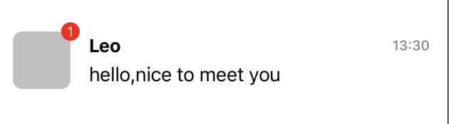

# FlexBoxUIKit


[](https://cocoapods.org/pods/FlexBoxUIKit)


基于[facebook/yoga](https://github.com/facebook/yoga)实现一个类似swiftui和Flutter的声明式UI框架

### Todo
* 百分比
* 代码注释
* 文档
    * HStackView  VStackView  ZStackView Column Row Stack
    * Wrap
    * ScrollView
    * Cell
    * UITableView
    * UICollectionView

    * margin padding left right top bottom 
    * flex 属性

* demo
    * 请求接口后更新数据

### Requirements
* iOS 9.0+
* Xcode 12.5
* Swift 5.4

### Installation
---
#### Cocoapods
```
pod 'FlexBoxUIKit', :git => 'https://github.com/BestYun/FlexBoxUIKit.git', :tag => '0.0.1'
```

### Usage 用法
#### Quick Start 快速开始
```swift
import FlexBoxUIKit  //1.导入FlexBoxUIKit
import UIKit

//2.继承FlexBaseViewController
class ViewController: FlexBaseViewController 
{
    override func viewDidLoad() {
        super.viewDidLoad()
    }
    //3.重写bodyView
    override func bodyView() -> UIView {
        return HStackView(mainAxis: .center, crossAxis: .center) {
            Text("Hello FlexBoxUIKit")
        }
        .flex(1)
    }
}

```

or
```swift
import FlexBoxUIKit

class ViewController: UIViewController{
    override func viewDidLoad() {
        super.viewDidLoad()
        view.flex.mainAxis(.center).crossAxis(.center).addItems {
            HStackView(mainAxis: .center, crossAxis: .center) {
                Text("Hello FlexBoxUIKit")
            }
        }
    }
    
    override func viewDidLayoutSubviews() {
        super.viewDidLayoutSubviews()
        view.flex.applyLayout()
    }
    
}
```

#### example1


```swift
HStackView {
    ZStackView {
        ImageView()
            .backgroundColor(UIColor.gray.withAlphaComponent(0.5))
            .cornerRadius(8)
            .left(0)
            .bottom(0)
            .size(width: 50, height: 50)
       
        Text("1")
            .fontSize(12)
            .textColor(.white)
            .right(0)
            .top(0)
            .size(16)
            .cornerRadius(8)
            .backgroundColor(.red)
            .textAlignment(.center)
    }
    .size(58)
    .margin(.right, 8)
   
    VStackView(mainAxis: .spaceAround) {
        HStackView(crossAxis: .center) {
            Text("Leo")
                .fontSize(16, weight: .bold)
                .expanded()
            Text("13:30")
                .fontSize(12, weight: .medium)
                .textColor(.gray)
        }

        Text("hello,nice to meet you")
    }
    .height(50)
    .expanded()
    .margin(.top, 8)
}
.padding(.horizontal, 15)
.margin(.top, 100)

```

### Documentation
https://reactnative.cn/docs/flexbox

### Modifier chain 链式语法
```swift
UILabel()
    .modifier
    .text("链式语法")
    .textColor(.orange)
    .font(.systemFont(ofSize: 16))
    .view
```
等同于
```swift
let label = UILabel()
label.text = "test apply"
label.font = .systemFont(ofSize: 16)
label.textColor = .orange
```

### apply sugar 只在UIView有效
```swift
UIView(frame: CGRect(x: 10, y: 100, width: 60, height: 60)).apply {
    $0.backgroundColor = .blue
    $0.layer.cornerRadius = 30
    $0.clipsToBounds = true
}

UILabel().apply { label in
    label.text = "test apply"
    label.font = .systemFont(ofSize: 16)
    label.textColor = .orange
}

```
等同于
```swift
let blueView = UIView(frame: CGRect(x: 10, y: 100, width: 60, height: 60))
blueView.backgroundColor = .blue
blueView.layer.cornerRadius = 30
blueView.clipsToBounds = true


let label = UILabel()
label.text = "test apply"
label.font = .systemFont(ofSize: 16)
label.textColor = .orange
```

## Flex makeLayout
```swift
UILabel().flex.makeLayout {
    $0.margin(.left, 10).margin(.top, 100)
}.apply {
    _ = $0.modifier
        .text("flex.makeLayout写法")
        .font(.systemFont(ofSize: 18))
        .textColor(.orange)
}
```

## 资料
https://tbfungeek.github.io/2019/11/05/%E5%9C%A8%E9%A1%B9%E7%9B%AE%E4%B8%AD%E4%BD%BF%E7%94%A8Yoga-%E5%B8%83%E5%B1%80%E5%BC%95%E6%93%8E/


TableView
https://github.com/josercc/SwiftTableViewGroup

## License

**FlexBoxUIKit** is under MIT license. See the [LICENSE](LICENSE) file for more info.